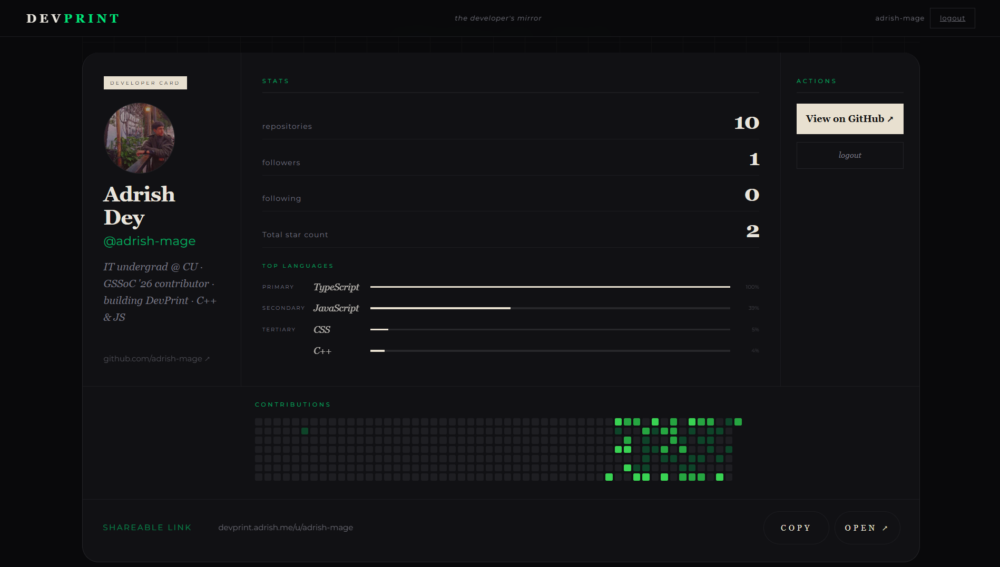

 

 

---

### 🌱 Open Source

**GSSoC 2026 Contributor** — 6 merged PRs across [DailyForge](https://github.com/aryandas2911/DailyForge) and [StorySpark AI](https://github.com/ronisarkarexe/story-spark-ai)

Recurring tasks · Bulk edit · Error boundaries · Reading progress bar

---

### ⚡ Stack

**Languages**

**Backend & Database**

**Tools & Auth**

---

### 📊 Stats

 

---

Always building · DMs open

